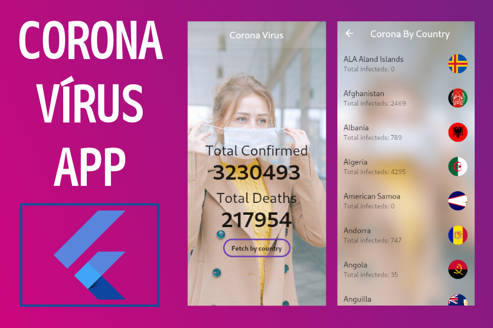

# Corona Virus App

### An application to know the number of infected and deaths by the corona virus in the world, or in each country.

This was an application developed in a few minutes to demonstrate the power of Get, a library that allows you to navigate without context, open snackbars from anywhere in your code, easily manage high performance states, and manage dependencies.
You can view the number of people killed and infected by the corona virus in the world, as well as for each specific country.

- Get https://github.com/jonataslaw/get 

